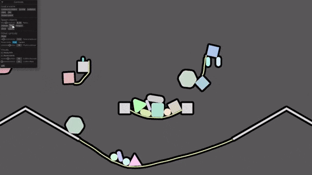

# Starframe

## What

In disc golf, a starframe occurs when every player in a group scores a birdie
on the same hole.

This starframe, however, is a 2D game engine written in Rust as a solo hobby
project. Its main feature is the physics engine, with design driven by
sidescrolling action games. It is currently being developed alongside
[Flamegrower](https://github.com/MoleTrooper/flamegrower), a platformer
about vines and fire.

## Current features



- novel graph-based entity system inspired by [froggy](https://github.com/kvark/froggy)
  - [related blog post](https://molentum.me/blog/starframe-architecture/)
    (somewhat outdated; many details have changed since)
- 2D rigid body and particle physics
  - high-fidelity solver based on [Extended Position-Based Dynamics][xpbd]
    - [related blog post](https://molentum.me/blog/starframe-constraints/)
  - collider shapes: circles, convex polygons, and rounded convex polygons
    - compound shapes of many of these also supported
  - raycasts and spherecasts
  - particle-based ropes with full coupling with rigid bodies
- graphics using [wgpu]
  - colored 2D meshes
  - dynamic outlines with the Jump Flood algorithm

## Who this is for

At least for now, this is intended just for my personal use. There are a lot of
rough edges, missing features, and even more missing documentation. It's very
far from something you can make an entire game with at the moment. That said,
the physics is perfectly usable already, at least for the things I'm doing with
it. If you want some really detailed 2D physics simulation and are adventurous
enough to learn how to use my quirky entity system, there might be some fun to
be had here.

## Blog

I write about this project once in a blue moon on [my website](https://molentum.me/blog/).

## Sandbox example

I have a little sandbox I use for testing new features where you can throw
blocks around with the mouse and move a rudimentary platformer character that
shoots some rather heavy bullets. Here's how you can check it out:

### In the browser

If you have access to a WebGPU-enabled browser (Firefox Nightly or Chrome Canary
with the right flag set), you can try out [this online build of the sandbox](https://molentum.me/sandbox/)!
Due to the instability of the feature in current browsers it may or may not work,
and it might not be the latest version here on git, but it's there and it's cool.
Thanks [wgpu]!

### The manual way

1. Install [Rust](https://www.rust-lang.org/learn/get-started)
2. You may need to install `pkgconfig` and drivers for Vulkan, DX12, or Metal
   depending on your platform
3. Clone and navigate to this repository
4. `cargo run --example sandbox`

### The easy way, using [Nix](https://nixos.org/nix/) (on Linux)

1. Clone and navigate to this repository
2. `nix-shell`
3. `cargo run --example sandbox`

### Keybindings

Disclaimer: these might be out of date - the sandbox changes in quick and
dirty ways

```text
Space   - step one frame while paused

Left mouse   - grab objects
Middle mouse - move the camera
Mouse wheel  - zoom the camera

Arrows  - move the player
LShift  - jump
Z       - shoot
```

[xpbd]: https://matthias-research.github.io/pages/publications/PBDBodies.pdf
[wgpu]: https://github.com/gfx-rs/wgpu-rs
